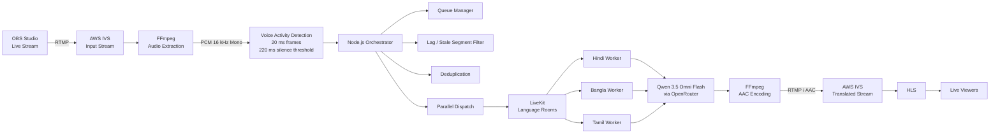

# LiveLingo 🎙️🌍

### Real-Time Multilingual Speech Translation for Live Streams

**LiveLingo** is a real-time multilingual speech translation system designed for live-streaming environments.

It captures live audio from an OBS stream, processes speech in real time, detects speech segments, sends them through a distributed translation pipeline, and rebroadcasts the translated audio as a live stream.

The system is designed specifically for **low-latency Indian-language translation**, with support and experimentation around languages such as **Hindi, Bangla/Bengali, and Tamil**.

---

## 🚀 Key Features

* 🎙️ Real-time speech extraction from live streams
* 📡 OBS + RTMP based live-stream ingestion
* ☁️ AWS IVS integration for live streaming
* 🔊 FFmpeg-based audio processing
* 🗣️ Voice Activity Detection (VAD)
* ⚡ Low-latency streaming pipeline
* 🔄 Real-time WebSocket-based processing
* 🧠 AI-powered speech translation
* 🌐 Indian-language translation support
* 🧵 Parallel translation workers
* 📦 Queue-based stream processing
* 🧹 Duplicate and stale-segment filtering
* 🎧 AAC audio encoding
* 📺 HLS-compatible output
* 🔁 Continuous live-stream rebroadcasting

---

# 🏗️ System Architecture

The complete LiveLingo pipeline can be summarized as:

```text
OBS Studio
    │
    │ RTMP
    ▼
AWS IVS
    │
    │ Live Audio
    ▼
FFmpeg
    │
    │ PCM 16 kHz Mono
    ▼
Voice Activity Detection
    │
    │ Speech Segments
    ▼
Node.js Orchestrator
    │
    ├── Queue Management
    ├── Lag Filtering
    ├── Deduplication
    ├── Parallel Dispatch
    └── Stream Synchronization
    │
    ▼
LiveKit Language Rooms
    │
    ├───────────────┬───────────────┐
    ▼               ▼               ▼
Hindi Worker    Bangla Worker   Tamil Worker
    │               │               │
    └───────────────┴───────────────┘
                    │
                    ▼
             AI Translation
                    │
                    ▼
          Qwen 3.5 Omni Flash
             via OpenRouter
                    │
                    ▼
              Translated Audio
                    │
                    ▼
                  FFmpeg
                    │
                    │ AAC / RTMP
                    ▼
                 AWS IVS
                    │
                    │ HLS
                    ▼
              Live Viewers
```

---

# 🧩 Mermaid Architecture Diagram



---

# 🔄 End-to-End Processing Pipeline

## 1. Live Stream Input

The broadcaster uses **OBS Studio** to publish the original live stream.

```text
OBS → RTMP → AWS IVS
```

AWS IVS acts as the live-stream ingestion and distribution layer.

---

## 2. Audio Extraction

FFmpeg extracts the audio component from the live stream.

The audio is converted into:

```text
Sample Rate: 16 kHz
Channels:    Mono
Format:      PCM
```

This provides a consistent input format for speech processing.

---

## 3. Voice Activity Detection

LiveLingo does not send every audio frame directly to the AI model.

Instead, Voice Activity Detection identifies sections containing speech.

The pipeline uses short audio frames and a silence threshold to determine when a speech segment is ready for processing.

This reduces unnecessary model calls and helps maintain low latency.

---

## 4. Node.js Orchestrator

The Node.js orchestrator is responsible for coordinating the real-time pipeline.

Its responsibilities include:

* Receiving speech segments
* Managing queues
* Dispatching work
* Removing stale segments
* Detecting duplicate segments
* Managing processing lag
* Parallel worker dispatch
* Maintaining stream freshness
* Coordinating language-specific processing

The orchestrator is one of the most important components for maintaining real-time performance.

---

## 5. LiveKit Language Rooms

After segmentation and orchestration, audio is routed through LiveKit.

Separate language processing paths can be maintained for different target languages.

Example:

```text
                    LiveKit
                       │
          ┌────────────┼────────────┐
          ▼            ▼            ▼
       Hindi        Bangla        Tamil
       Worker       Worker        Worker
```

This allows language processing to happen concurrently.

---

# 🧠 AI Translation Layer

The translation workers process the incoming speech using AI models.

The project experimented with:

* **Qwen 3.5 Omni Flash**
* **OpenRouter**
* **Sarvam AI APIs**

The AI layer is responsible for converting the incoming spoken content into the requested target language.

The architecture intentionally separates the AI layer from the stream orchestration layer.

This makes it possible to change or upgrade the translation model without redesigning the complete streaming system.

---

# 🔊 Output Audio Pipeline

Once translation is completed, the translated audio is passed back into the streaming pipeline.

```text
Translated Audio
       │
       ▼
    FFmpeg
       │
       ▼
AAC Encoding
       │
       ▼
RTMP
       │
       ▼
AWS IVS
       │
       ▼
HLS
       │
       ▼
Live Viewer
```

This allows viewers to consume the translated stream using standard HLS-compatible playback.

---

# ⚡ Latency Optimization

LiveLingo was designed around real-time processing rather than traditional request/response translation.

Several optimizations were incorporated into the architecture:

### 1. Speech segmentation

Instead of processing the complete stream, speech is divided into manageable segments.

### 2. Parallel processing

Multiple language workers can process audio concurrently.

### 3. Queue freshness

Old audio becomes less useful in a live stream.

Therefore, stale segments can be discarded instead of allowing them to create an ever-growing processing backlog.

### 4. Deduplication

Repeated segments are filtered to avoid unnecessary processing.

### 5. WebSocket / real-time transport

Streaming communication avoids repeatedly establishing traditional request/response pipelines.

### 6. Rolling-buffer fallback

A rolling audio buffer can be used to maintain continuity when processing temporarily falls behind.

---

# 📊 Performance

During project evaluation, the system achieved approximately:

| Language | Average Latency |
| -------- | --------------: |
| Hindi    |         ~1.89 s |
| Bangla   |         ~2.04 s |
| Tamil    |         ~2.12 s |

Additional reported evaluation metrics included:

| Metric           | Result |
| ---------------- | ------ |
| BLEU             | ~34.2  |
| Real-Time Factor | < 1.0  |
| Hindi WER        | ~9.2%  |
| Bangla WER       | ~10.8% |
| Tamil WER        | ~11.3% |

The exact performance depends on model response time, network conditions, audio quality, infrastructure, and stream load.

---

# 🛠️ Technology Stack

## Streaming

* OBS Studio
* RTMP
* AWS IVS
* HLS
* FFmpeg

## Backend / Orchestration

* Node.js
* WebSockets
* Event-driven processing
* Queue-based processing

## Real-Time Communication

* LiveKit

## AI / Speech

* Qwen 3.5 Omni Flash
* OpenRouter
* Sarvam AI

## Speech Processing

* Voice Activity Detection
* PCM audio processing
* Audio segmentation

## Infrastructure

* AWS
* GPU-backed processing infrastructure where required

---

# 📁 Project Structure

The repository should follow a structure similar to:

```text
LiveLingo/
│
├── backend/
│   ├── src/
│   ├── services/
│   ├── workers/
│   ├── routes/
│   └── ...
│
├── frontend/
│   ├── src/
│   └── ...
│
├── workers/
│   ├── hindi/
│   ├── bangla/
│   ├── tamil/
│   └── ...
│
├── scripts/
│   ├── audio/
│   ├── streaming/
│   └── deployment/
│
├── config/
│
├── docs/
│
├── .env.example
├── .gitignore
├── package.json
└── README.md
```

> **Note:** Adjust this section to exactly match the current repository structure before publishing the README.

---

# ⚙️ Prerequisites

Before running LiveLingo, install/configure:

* Node.js
* npm
* Python 3.x
* FFmpeg
* OBS Studio
* AWS account
* AWS IVS channel
* LiveKit server/project
* OpenRouter API key
* Sarvam API credentials if using Sarvam services

Verify the main dependencies:

```bash
node --version
npm --version
python --version
ffmpeg -version
```

---

# 🔐 Environment Variables

Create a local environment file based on the project's environment template.

Example:

```env
# AWS
AWS_ACCESS_KEY_ID=
AWS_SECRET_ACCESS_KEY=
AWS_REGION=

# AWS IVS
IVS_INPUT_URL=
IVS_OUTPUT_URL=
IVS_CHANNEL_ARN=

# LiveKit
LIVEKIT_URL=
LIVEKIT_API_KEY=
LIVEKIT_API_SECRET=

# AI
OPENROUTER_API_KEY=

# Sarvam
SARVAM_API_KEY=

# Application
NODE_ENV=development
PORT=3000
```

**Never commit real API keys or cloud credentials to GitHub.**

Use:

```text
.env
```

in `.gitignore` and commit only:

```text
.env.example
```

---

# ▶️ Running the Project

Because LiveLingo consists of multiple real-time services, start each service according to its responsibility.

## 1. Start the backend/orchestrator

```bash
cd backend
npm install
npm run dev
```

---

## 2. Start the Python workers

Create and activate a virtual environment:

### Windows

```powershell
python -m venv .venv
.venv\Scripts\activate
```

### Linux / macOS

```bash
python3 -m venv .venv
source .venv/bin/activate
```

Install dependencies:

```bash
pip install -r requirements.txt
```

Start the required worker processes using the commands defined by the repository.

---

## 3. Start LiveKit

Configure your LiveKit server/project and provide:

```env
LIVEKIT_URL=
LIVEKIT_API_KEY=
LIVEKIT_API_SECRET=
```

The orchestrator uses LiveKit to route real-time audio between the language-processing components.

---

## 4. Configure OBS

In OBS:

```text
Settings
   ↓
Stream
   ↓
Custom Streaming Server
```

Configure the RTMP endpoint supplied by AWS IVS.

Then:

```text
Start Streaming
```

The stream follows:

```text
OBS
 ↓
AWS IVS
 ↓
FFmpeg
 ↓
LiveLingo
```

---

# 🌐 Live Translation Flow

Once all services are running:

```text
1. Start AWS IVS
2. Start LiveKit
3. Start Node.js orchestrator
4. Start Python translation workers
5. Start FFmpeg processing pipeline
6. Configure OBS
7. Start OBS streaming
8. Verify incoming IVS stream
9. Verify speech segmentation
10. Verify worker processing
11. Verify translated output
12. Publish translated stream through AWS IVS
13. Open the HLS playback URL
```

---

# 🧪 Testing

Before testing the complete pipeline, verify each component independently.

### Audio extraction

Verify FFmpeg is receiving audio correctly.

### VAD

Verify speech segments are generated only when speech is detected.

### Orchestrator

Verify:

* Queue processing
* Segment dispatch
* Deduplication
* Stale segment removal
* Worker communication

### Translation Worker

Verify that a sample audio segment can be translated independently.

### Streaming

Verify:

```text
OBS → IVS → Processing → IVS → HLS
```

before testing multiple languages simultaneously.

---

# 🐛 Troubleshooting

## FFmpeg cannot connect

Check:

```text
RTMP URL
AWS IVS configuration
Network connectivity
AWS credentials
```

---

## No speech segments are generated

Check:

* Audio format
* Sample rate
* VAD threshold
* FFmpeg output
* Microphone/stream audio

---

## Translation is delayed

Check:

* AI model response time
* Worker concurrency
* Network latency
* Queue size
* Stale-segment filtering
* GPU/CPU utilization

A live translation system should prioritize stream freshness over processing every historical segment.

---

## Translated stream stops

Check:

```text
FFmpeg process
AWS IVS ingest
RTMP connection
Worker availability
AI API response
```

---

# 🔒 Security

Never commit:

```text
.env
API keys
AWS credentials
LiveKit secrets
Private keys
Access tokens
```

Use:

```text
.env.example
```

for documentation.

For production deployments, secrets should be stored using an appropriate secret-management solution rather than hardcoded into source code.

---

# 🎯 Design Goals

LiveLingo was designed around four major goals:

### Low Latency

Keep translation close to real-time so translated speech remains synchronized with the original stream.

### Scalability

Allow additional language workers to be added without redesigning the entire pipeline.

### Fault Isolation

Separate streaming, orchestration, translation, and output processing so that individual components can be restarted or scaled independently.

### Indian Language Support

Focus on practical multilingual speech processing for Indian languages that are often poorly served by traditional real-time translation systems.

---

# 🧱 Architectural Principles

### Event-driven processing

Audio is treated as a continuous stream of events rather than isolated HTTP requests.

### Loose coupling

The orchestrator, workers, AI model, and streaming layer communicate through well-defined interfaces.

### Horizontal scalability

Language workers can be replicated independently.

For example:

```text
Hindi Worker × 3
Bangla Worker × 2
Tamil Worker × 2
```

depending on workload.

### Backpressure

The system monitors processing lag and prevents old audio from continuously accumulating in queues.

### Model abstraction

The translation model is isolated from the rest of the architecture so different AI providers/models can be integrated later.

---

# 📈 Future Improvements

Potential future improvements include:

* More Indian languages
* Automatic language detection
* Speaker identification
* Speaker diarization
* Improved code-switching support
* Adaptive buffering
* Dynamic worker autoscaling
* GPU optimization
* Translation quality monitoring
* Translation confidence scoring
* Subtitle generation
* Real-time captions
* Multiple simultaneous target languages
* Kubernetes deployment
* Distributed observability
* Prometheus/Grafana monitoring
* Automatic stream recovery

---

# ⚠️ Current Limitations

The system can experience reduced performance under:

* Noisy outdoor audio
* Heavy background music
* Multiple speakers talking simultaneously
* Strong code-switching
* Poor network conditions
* High AI model latency
* Extremely long speech segments

Latency and translation quality are also dependent on the selected AI model and infrastructure.

---

# 📚 Research / Evaluation

The system was evaluated using speech translation quality and real-time performance metrics including:

* BLEU
* Word Error Rate (WER)
* Real-Time Factor (RTF)
* End-to-end latency

The target was to maintain:

```text
RTF < 1
```

which indicates that the system can process audio faster than real-time under the evaluated conditions.

---

# 👨‍💻 Author

**Shivam Jha**

Computer Science & Engineering

GitHub: [Add your GitHub profile]

---

# 📄 License

Add the project's chosen license here.

For example:

```text
MIT License
```

if the project is intended to be released under MIT.

---

# ⭐ Contributing

Contributions are welcome.

Typical workflow:

```bash
git checkout -b feature/your-feature
git add .
git commit -m "Add: your feature"
git push origin feature/your-feature
```

Then open a Pull Request.

---

# 💡 Project Summary

LiveLingo transforms a conventional live stream into a multilingual live experience.

```text
        ORIGINAL SPEECH
               │
               ▼
          OBS / RTMP
               │
               ▼
            AWS IVS
               │
               ▼
          FFmpeg + VAD
               │
               ▼
        Node.js Orchestrator
               │
               ▼
            LiveKit
               │
       ┌───────┼───────┐
       ▼       ▼       ▼
     Hindi   Bangla   Tamil
     Worker  Worker   Worker
       │       │       │
       └───────┼───────┘
               ▼
       AI Speech Translation
               │
               ▼
             FFmpeg
               │
               ▼
            AWS IVS
               │
               ▼
              HLS
               │
               ▼
        MULTILINGUAL VIEWERS
```

**LiveLingo is built to demonstrate how modern streaming infrastructure, real-time communication, distributed workers, and generative AI can be combined to build a low-latency multilingual live translation platform.**
